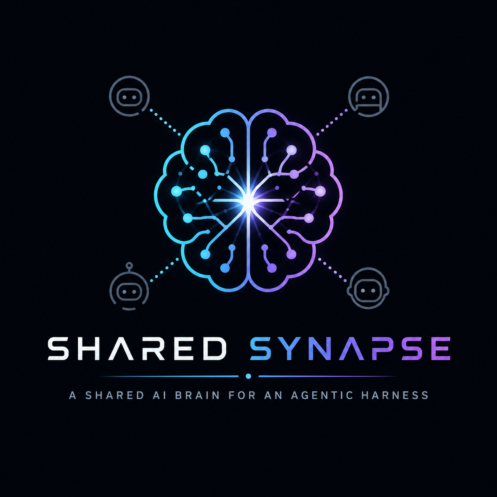

# Shared Synapse

A Git-backed, Chroma-indexed, MCP-exposed intelligence layer for developers and AI agents. Shared Synapse ingests structured knowledge into a shared memory graph, activates the right synapses for a task, and surfaces the result through a backend MCP server, a FastAPI REST layer, a Vue 3 frontend, a standalone CLI, and a VS Code extension.

## High-Level Concepts

- **Brain stem baseline**: `core-brainstem` is the always-on synapse that represents team-wide rules, workflow constraints, and shared concepts.
- **Optional neurons**: Backend and frontend work activate additional synapses that connect the relevant rules, skills, tools, decisions, and designs.
- **Knowledge-first system**: Markdown, YAML, and JSON files under `knowledge/` and `synapses/` remain the durable source material for the intelligence layer.
- **Ingestion pipeline**: Files are parsed into typed documents, chunked into retrieval-friendly segments, embedded with a sentence-transformer model, and stored in ChromaDB.
- **Hybrid retrieval**: Queries use semantic vector search plus structured metadata filters, then pass through a re-ranking stage to improve relevance.
- **MCP access layer**: The backend FastMCP server exposes search, retrieval, knowledge-management, skill, rule, and synapse operations for multiple agents.
- **Auth & RBAC**: JWT-based login with three roles (`admin`, `contributor`, `viewer`). An admin is created automatically on first start.
- **Synapse management UI**: Create, edit, activate/deactivate, and delete neuron bundles from the browser.
- **CLI agent**: `synapse` CLI connects to the hosted API or runs a local MCP agent.
- **VS Code extension**: Auto-connects to your server, lets you search knowledge, activate synapses, and push highlighted code from within VS Code.

---

## Quick Start

### 1. Start ChromaDB

```bash
docker compose up -d
```

### 2. Install backend dependencies

```bash
cd backend
pip install -e ".[dev]"
```

### 3. Configure backend environment

```bash
cp backend/.env.example backend/.env
# Edit .env – set JWT_SECRET_KEY and ADMIN_DEFAULT_PASSWORD at minimum
```

### 4. Install frontend dependencies

```bash
cd frontend
npm install
```

### 5. Run ingestion

```python
import asyncio
from src.ingestion import run_ingestion

asyncio.run(run_ingestion())
```

Run this from `backend/`.

### 6. Start the backend MCP server

```bash
cd backend
python -m src.mcp_server.server
```

### 6b. Start the REST API (auth + synapse management)

```bash
cd backend
uvicorn src.api:app --reload --port 8000
```

The first startup creates an `admin` user with the password from `ADMIN_DEFAULT_PASSWORD` (default: `changeme`). Change it immediately.

### 7. Start the Vue 3 frontend

```bash
cd frontend
npm run dev
```

Visit `http://localhost:5173` → log in → manage synapses, neurons, and users from the UI.

### 8. Install and use the CLI

```bash
cd cli
pip install -e .

# Connect to your server
synapse connect http://localhost:8000 --username admin

# Search knowledge
synapse search "how does authentication work"

# Push a file to knowledge
synapse add ./my-notes.md --type concept

# Start a local MCP agent
synapse agent
```

### 9. Install the VS Code extension

```bash
cd vscode-extension
npm install
npm run compile
npm run package    # produces shared-synapse-*.vsix
code --install-extension shared-synapse-*.vsix
```

Then run **Shared Synapse: Connect to Server** from the command palette.

---

## Architecture

```
backend/            # Python MCP backend and Chroma-backed ingestion/retrieval code
  src/api.py        # FastAPI REST app (auth, user management, synapse CRUD)
  src/auth.py       # JWT login/refresh/logout + require_role dependency
  src/user_management.py  # Admin user CRUD endpoints
  src/db/users_store.py   # SQLite user + refresh-token store
  src/db/synapses_store.py # YAML synapse CRUD + active-set tracking
frontend/           # Vue 3 control surface for synapses, auth, and user management
  src/api.js        # Axios service layer with JWT auto-refresh
  src/composables/useAuth.js  # Auth composable (login, logout, role)
  src/router/index.js   # Vue Router with auth guard + role guard
  src/views/        # LoginView, SynapsesView, SynapseEditView, BrainStemView, AdminUsersView
cli/                # synapse CLI (connect, search, add, activate, agent, sync)
vscode-extension/   # VS Code VSIX extension (auto-connect, commands, MCP bridge)
knowledge/          # Concepts, decisions, rules, skills, tools, and designs
synapses/           # YAML activation bundles connecting neurons and the core brain stem
```

**Data flow:**
1. Files are parsed (frontmatter + content extracted)
2. Content is chunked (300–800 tokens, 15% overlap, header-aware)
3. Chunks are embedded (`all-MiniLM-L6-v2`, 384-dim)
4. Documents, chunks, and tool definitions stored in ChromaDB collections
5. MCP server receives queries, embeds them, runs HNSW vector search, re-ranks, returns results
6. FastAPI REST layer exposes auth, user management, synapse CRUD, and search to the frontend and CLI

---

## Auth & RBAC

| Role | Permissions |
|------|-------------|
| `admin` | Full CRUD on synapses, users, knowledge, nominations |
| `contributor` | Add/update knowledge, nominate, vote, activate synapses |
| `viewer` | Search and read only |

A default `admin` user is created on first startup. Change the password via the Users admin page or by setting `ADMIN_DEFAULT_PASSWORD` before first start.

---

## REST Endpoints (FastAPI)

| Method | Path | Role | Description |
|--------|------|------|-------------|
| POST | `/auth/login` | public | Issue JWT + refresh token |
| POST | `/auth/refresh` | public | Refresh access token |
| POST | `/auth/logout` | public | Revoke refresh token |
| GET | `/admin/users` | admin | List users |
| POST | `/admin/users` | admin | Create user |
| PATCH | `/admin/users/{id}/role` | admin | Update user role |
| PATCH | `/admin/users/{id}/deactivate` | admin | Deactivate user |
| GET | `/api/synapses` | viewer | List synapses |
| GET | `/api/synapses/{name}` | viewer | Get synapse detail |
| PUT | `/api/synapses/{name}` | admin | Create/update synapse |
| DELETE | `/api/synapses/{name}` | admin | Delete synapse |
| POST | `/api/synapses/{name}/activate` | contributor | Activate synapse |
| POST | `/api/synapses/{name}/deactivate` | contributor | Deactivate synapse |
| GET | `/api/search` | viewer | Semantic search |
| POST | `/api/knowledge` | contributor | Add knowledge document |
| POST | `/api/reindex` | admin | Trigger full re-ingestion |

## MCP Endpoints

| Tool | Description |
|------|-------------|
| `search_knowledge` | Semantic search with optional filters (`type`, `tags`, `context_pack`) |
| `get_document` | Retrieve full document by ID |
| `get_context_pack` | Retrieve a named synapse/context bundle |
| `get_synapse` | Retrieve a named synapse using the new terminology |
| `list_tools` | List and rank tools relevant to a task |
| `execute_tool` | Execute a registered tool by ID with JSON input |
| `add_knowledge` | Add/update a knowledge document directly (re-indexed immediately, shared across all agents) |
| `update_knowledge` | Update an existing document and re-index it; auto-marks dependent skills for refresh |
| `delete_knowledge` | Remove a document and its chunks; marks dependent skills for refresh |
| `reindex_knowledge` | Trigger full re-ingestion from the file system |
| `get_skill` | Retrieve a skill by ID (name, instructions, triggers, dependencies) |
| `list_skills` | List skills, optionally filtered by context tag |
| `upsert_skill` | Create or update a skill; immediately shared with all connected agents |
| `get_rule` | Retrieve a behavioral rule by ID |
| `list_rules` | List rules by priority; optionally filtered by context |
| `nominate_knowledge` | Nominate a knowledge document for inclusion in shared neurons (concurrent users can propose, vote, approve) |
| `list_nominations` | List knowledge nominations filtered by status (`pending`, `approved`, `rejected`) |
| `vote_nomination` | Cast an up/down vote on a pending nomination; each user may vote once |
| `approve_nomination` | Approve a nomination and immediately ingest it into the shared neuron store |
| `reject_nomination` | Reject a nomination without ingesting it |
| `add_conversation_entry` | Append an entry to a user's per-user nested conversation history (memory palace layer: conversation → session → entry) |
| `get_conversation` | Retrieve a user's full conversation tree nested as conversations → sessions → entries, oldest-first |
| `list_conversations` | List all named conversation rooms for a user with session and entry counts, newest first |
| `list_synapses` | List all synapse definitions with name, activation type, and current active status |
| `get_synapse_detail` | Full synapse definition including includes, tags, common_tasks, recommended_tools |
| `upsert_synapse` | Create or update a synapse YAML bundle (re-indexed immediately) |
| `delete_synapse` | Delete a synapse YAML bundle and purge its index entries |
| `activate_synapse` | Mark an optional synapse as active |
| `deactivate_synapse` | Remove an optional synapse from the active set |

### Example: search_knowledge

```json
{
  "query": "how does authentication work",
  "filters": "{\"tags\": [\"auth\", \"backend\"]}"
}
```

### Example: list_tools

```json
{
  "task": "manage API routes",
  "context": "backend infrastructure"
}
```

---

## Development

### Run tests

```bash
pytest
```

### Project layout

- `backend/src/db/` — Chroma-backed CRUD layer for documents, chunks, tools, skills, and rules
- `backend/src/ingestion/` — File parser, token-aware chunker, sentence-transformer embeddings, pipeline orchestrator
- `backend/src/retrieval/` — Hybrid search (vector + filters), result re-ranker
- `backend/src/mcp_server/` — FastMCP server, input validation, audit logging, and synapse access
- `frontend/src/` — Vue 3 application for the Shared Synapse control surface

### Knowledge taxonomy

- `knowledge/skills/` — Reusable workflows.
- `knowledge/rules/` — Durable engineering standards and constraints.
- `knowledge/tools/` — Tool definitions, APIs, and MCP-adjacent integrations.
- `knowledge/decisions/` — Architectural and design decisions.
- `knowledge/concepts/` — High-level concepts and system overviews.
- `knowledge/designs/` — Theme and visual-direction documents.
- `synapses/` — Curated activation bundles that pull from multiple categories.

### Adding knowledge

Drop `.md`, `.yaml`, or `.json` files into the appropriate directory:

- `knowledge/concepts/` → type `concept`
- `knowledge/decisions/` → type `decision`
- `knowledge/designs/` → type `design`
- `knowledge/skills/` → type `skill`
- `knowledge/rules/` → type `rule`
- `knowledge/tools/` → type `tool`
- `synapses/` → type `context_pack`

Then re-run ingestion to index them.

## Bundled Rules and Skills

The repository now ships a first-class set of bundled rules and skills under `knowledge/rules/` and `knowledge/skills/`.

- Rules capture the current engineering standards for API design, backend architecture, Python, frontend runtime and styling, deployment, security, and workflow.
- Skills capture reusable workflows such as adding an MCP or API endpoint, debugging auth, finding external skills, UI and UX review, reading VS Code search results, and agent customization.
- The `core-brainstem`, `backend`, and `frontend` synapses activate the right knowledge bundles for a given neuron or team surface.

---

## Environment Variables

| Variable | Default | Description |
|----------|---------|-------------|
| `CHROMA_HOST` | `localhost` | Chroma server hostname; leave empty to use local persistent storage |
| `CHROMA_PORT` | `8000` | Chroma server port |
| `CHROMA_PATH` | `../.chroma` | Local persistent Chroma path when no host is configured |
| `EMBEDDINGS_MODEL` | `all-MiniLM-L6-v2` | Sentence-transformer model name |
| `KNOWLEDGE_REPO_PATH` | `..` | Root path to scan for knowledge and synapse files |
| `LOG_LEVEL` | `INFO` | Python logging level |
| `JWT_SECRET_KEY` | `change-me-in-production-please` | Secret used to sign JWTs – **always override in production** |
| `ACCESS_TOKEN_EXPIRE_MINUTES` | `30` | JWT access token lifetime in minutes |
| `REFRESH_TOKEN_TTL_DAYS` | `30` | Refresh token lifetime in days |
| `ADMIN_DEFAULT_PASSWORD` | `changeme` | Password for the auto-created `admin` user on first start |
| `CORS_ORIGINS` | `http://localhost:5173,http://localhost:3000` | Comma-separated allowed origins for the FastAPI app |
| `USERS_DB_PATH` | `../.synapse_users.db` | SQLite path for user and refresh-token storage |
| `SYNAPSES_DIR` | `../synapses` | Directory containing synapse YAML files |

---

## License

MIT
