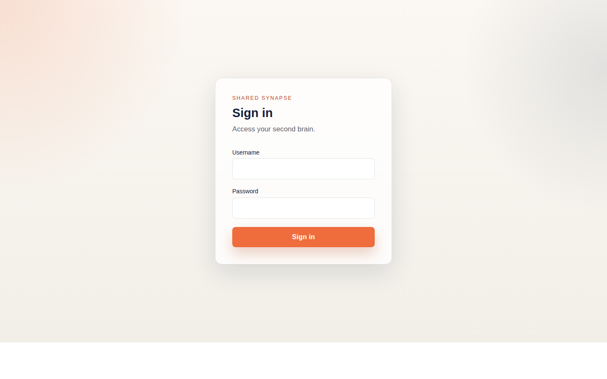
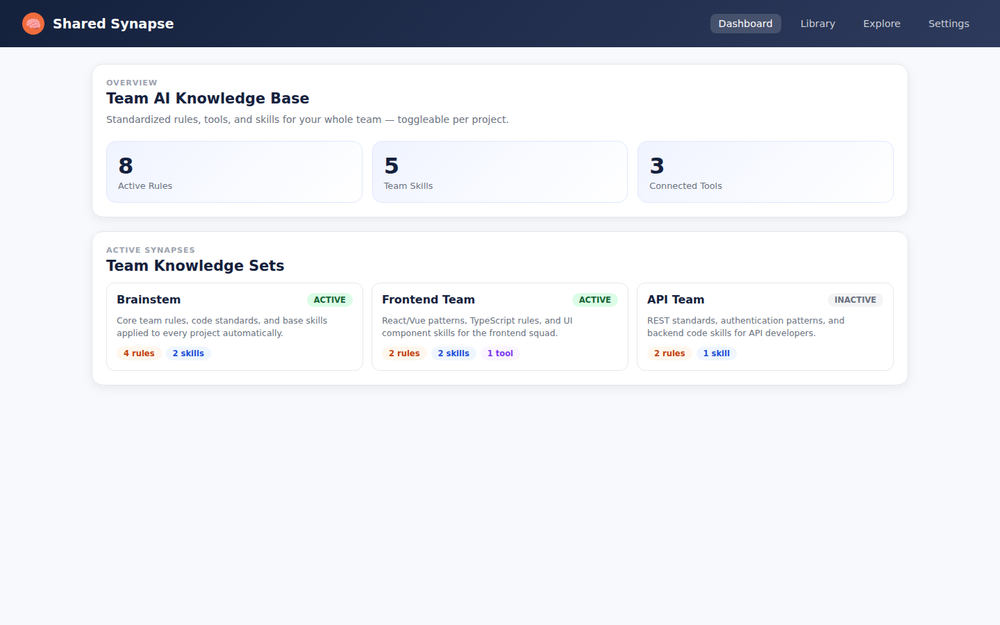
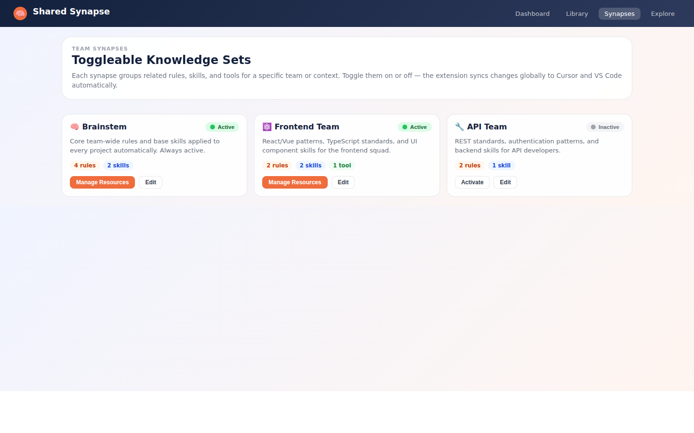
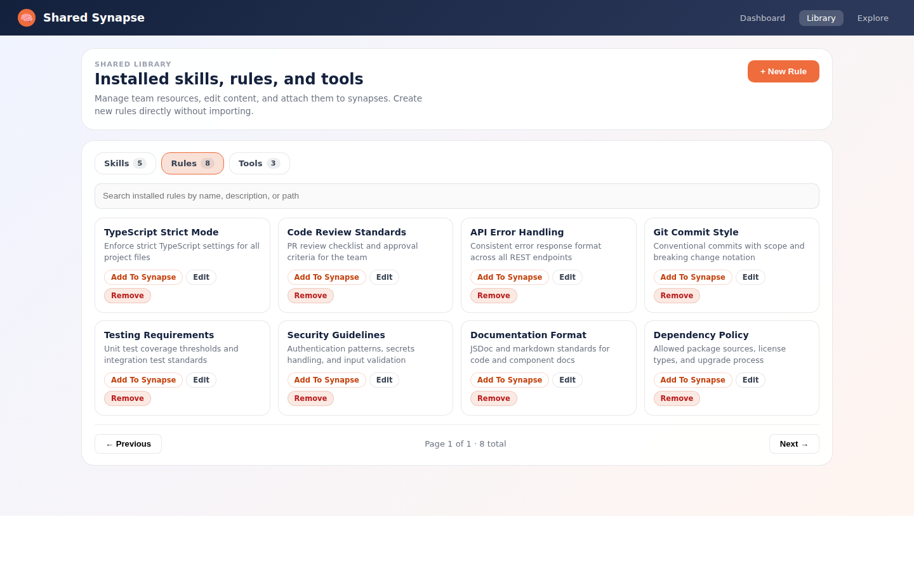
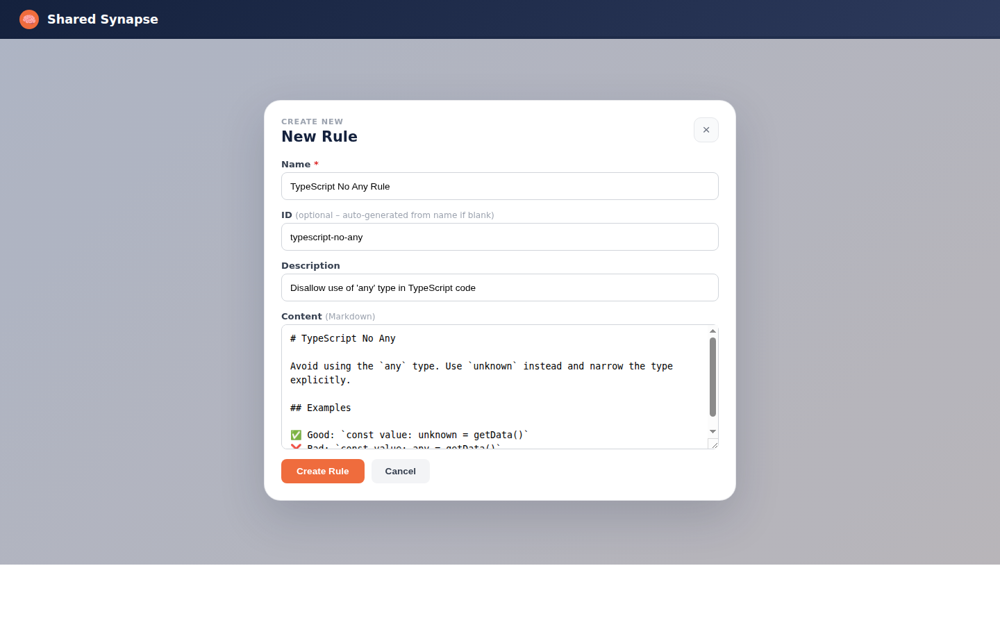
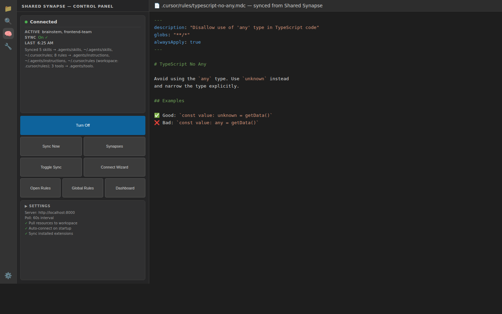

# Shared Synapse

**One place to define the rules, skills, and tools your whole engineering team follows — automatically delivered to every developer's AI assistant.**

---

## The Problem

Every developer on your team has an AI coding assistant. But each one has its own prompts, its own rules, and its own idea of what "our standards" look like. The result: inconsistent code, duplicated effort, and a constant battle to get AI tools to follow conventions that your team spent years defining.

- Your TypeScript standards live in one person's Cursor config.
- Your code-review checklist is copy-pasted into three different system prompts.
- A new hire's AI assistant knows nothing about your team's patterns until someone sits down and explains it.
- When a standard changes, you have no way to push that update to everyone at once.

---

## What Shared Synapse Does

Shared Synapse is a central hub where your team maintains a single authoritative library of **rules**, **skills**, and **tools**. The VS Code/Cursor extension then automatically distributes that library to every developer's AI assistant — globally and in real time.

**Rules** are standards your AI should always follow: coding conventions, security requirements, review criteria, commit formats.

**Skills** are reusable workflows your AI can execute: "add an API endpoint", "debug auth issues", "run a UX review".

**Tools** are integrations your AI can call: APIs, MCP servers, custom scripts.

You group related resources into **Synapses** — bundles that can be activated or deactivated per team or context. A `frontend` synapse turns on React/TypeScript rules and component skills. An `api` synapse turns on REST standards and auth patterns. The `brainstem` synapse is always on and holds the rules every developer should follow, no matter what they're working on.

---

## Why Teams Use This

| Without Shared Synapse | With Shared Synapse |
|---|---|
| Each developer maintains their own AI config | One team-owned library, everyone stays in sync |
| Standards drift between developers over time | A rule change propagates to every AI assistant on next sync |
| Onboarding means manually configuring AI tools | New developers get the team's full standards automatically |
| No visibility into what rules are active | A shared UI shows exactly what's applied and where |
| AI assistance varies wildly across the codebase | Consistent, standards-aware AI across all developers |

---

## How It Works

1. **Admins define resources** in the web UI — write a rule, build a skill, or register a tool directly in the browser. No files to hunt down or import.
2. **Resources are grouped into Synapses** — toggle a synapse on or off per team. Changes are reflected immediately.
3. **The VS Code/Cursor extension syncs automatically** — on every poll cycle it writes active rules and skills to four places on the developer's machine: workspace `.cursor/rules/`, global `~/.cursor/rules/`, workspace `.agents/instructions/`, and global `~/.agents/instructions/`. Every AI assistant on that machine picks them up with no further action.
4. **Developers stay in sync** without thinking about it — they open VS Code, connect once, and the extension handles the rest.

---

## Quick Start

### 1. Start ChromaDB

```bash
docker compose up -d
```

### 2. Install backend dependencies

```bash
cd backend
pip install -e ".[dev]"
```

### 3. Configure backend environment

```bash
cp backend/.env.example backend/.env
# Edit .env – set JWT_SECRET_KEY and ADMIN_DEFAULT_PASSWORD at minimum
```

### 4. Install frontend dependencies

```bash
cd frontend
npm install
```

### 5. Run ingestion

```python
import asyncio
from src.ingestion import run_ingestion

asyncio.run(run_ingestion())
```

Run this from `backend/`.

### 6. Start the backend MCP server

```bash
cd backend
python -m src.mcp_server.server
```

### 6b. Start the REST API (auth + synapse management)

```bash
cd backend
uvicorn main:app --reload --port 8000
```

The first startup creates an `admin` user with the password from `ADMIN_DEFAULT_PASSWORD` (default: `changeme`). Change it immediately.

### 7. Start the Vue 3 frontend

```bash
cd frontend
npm run dev
```

Visit `http://localhost:5173` → log in → manage synapses, neurons, and users from the UI.

### 8. Install and use the CLI

```bash
cd cli
pip install -e .

# Connect to your server
synapse connect http://localhost:8000 --username admin

# Search knowledge
synapse search "how does authentication work"

# Push a file to knowledge
synapse add ./my-notes.md --type concept

# Start a local MCP agent
synapse agent
```

### 9. Install the VS Code extension

```bash
cd vscode-extension
npm install
npm run compile
npm run package    # produces shared-synapse-*.vsix
code --install-extension shared-synapse-*.vsix
```

Then run **Shared Synapse: Connect to Server** from the command palette.

---

## Screenshots

### 1 — Login


Secure JWT-based login with role-based access control (admin / contributor / viewer). Admins manage the shared library; contributors propose changes; viewers search and browse.

---

### 2 — Dashboard Overview


See at a glance which synapses are active, how many rules, skills, and tools your team has defined, and the current sync state across all connected developers.

---

### 3 — Synapses — Toggle Standards Per Team or Context


Group your resources into **Synapse bundles** — one per team, squad, or project context. Toggle a synapse on or off and the extension propagates the change globally to every active developer's AI assistant within one poll cycle. The `brainstem` synapse stays always-on and holds the standards every developer follows everywhere.

---

### 4 — Library — One Place for All Team Resources


The shared library is the single source of truth for your team's rules, skills, and tools. Browse by type, search by name or description, attach resources to synapses, and edit content in-place. Admins can author a new resource directly from the **+ New Rule / Skill / Tool** button — no file hunting or importing required.

---

### 5 — Create New Rule (UI Editor)


Write a rule right in the browser. Give it a name, an optional slug (auto-generated if blank), a one-line description, and full Markdown content. On save it is written to `knowledge/rules/`, indexed immediately, and distributed to all connected developers on their next sync cycle.

---

### 6 — VS Code / Cursor Extension — Automatic Global Delivery


The sidebar shows which synapses are active and whether sync is running. When sync is on, active rules and skills are written to **four locations on the developer's machine** simultaneously — so every AI tool they use picks them up without any manual steps:

| Destination | AI Tool |
|---|---|
| `.agents/instructions/` (workspace) | VS Code Copilot — this project |
| `~/.agents/instructions/` (user-global) | VS Code Copilot — all projects |
| `.cursor/rules/` (workspace) | Cursor — this project |
| `~/.cursor/rules/` (user-global) | **Cursor — all projects** |

**Toggle Sync** pauses or resumes background polling instantly. **Open Rules** opens the workspace folder; **Global Rules** opens `~/.cursor/rules/` in the OS file manager so you can verify what was written.

---

## Architecture

```
backend/            # Python MCP backend and Chroma-backed ingestion/retrieval code
  src/api.py        # FastAPI REST app (auth, user management, synapse CRUD, resource creation)
  src/auth.py       # JWT login/refresh/logout + require_role dependency
  src/user_management.py  # Admin user CRUD endpoints
  src/db/users_store.py   # SQLite user + refresh-token store
  src/db/synapses_store.py # YAML synapse CRUD + active-set tracking
frontend/           # Vue 3 web UI for managing the shared library and synapses
  src/api.js        # Axios service layer with JWT auto-refresh
  src/composables/useAuth.js  # Auth composable (login, logout, role)
  src/router/index.js   # Vue Router with auth guard + role guard
  src/views/        # LoginView, SynapsesView, LibraryView, SynapseEditView, AdminUsersView
cli/                # synapse CLI (connect, search, add, activate, agent, sync)
vscode-extension/   # VS Code/Cursor VSIX extension — syncs active resources to the developer's machine
knowledge/          # Rules, skills, tools, concepts, decisions, and designs
synapses/           # YAML activation bundles — each bundle is a toggleable set of resources
```

**Data flow:**
1. Files are parsed (frontmatter + content extracted)
2. Content is chunked (300–800 tokens, 15% overlap, header-aware)
3. Chunks are embedded (`all-MiniLM-L6-v2`, 384-dim)
4. Documents, chunks, and tool definitions stored in ChromaDB collections
5. MCP server receives queries, embeds them, runs HNSW vector search, re-ranks, returns results
6. FastAPI REST layer exposes auth, user management, synapse CRUD, and search to the frontend and CLI

---

## Auth & RBAC

| Role | Permissions |
|------|-------------|
| `admin` | Full CRUD on synapses, users, knowledge, nominations |
| `contributor` | Add/update knowledge, nominate, vote, activate synapses |
| `viewer` | Search and read only |

A default `admin` user is created on first startup. Change the password via the Users admin page or by setting `ADMIN_DEFAULT_PASSWORD` before first start.

---

## API Reference

The backend exposes a full REST API with interactive documentation auto-generated by FastAPI.

Once the backend is running, open **`http://localhost:8000/docs`** in your browser for the complete Swagger UI — every endpoint, request schema, response model, and role requirement is documented there. An alternative ReDoc view is available at **`http://localhost:8000/redoc`**.

---

## Development

### Run tests

```bash
pytest
```

### Project layout

- `backend/src/db/` — Chroma-backed CRUD layer for documents, chunks, tools, skills, and rules
- `backend/src/ingestion/` — File parser, token-aware chunker, sentence-transformer embeddings, pipeline orchestrator
- `backend/src/retrieval/` — Hybrid search (vector + filters), result re-ranker
- `backend/src/mcp_server/` — FastMCP server, input validation, audit logging, and synapse access
- `frontend/src/` — Vue 3 application for the Shared Synapse control surface

### Knowledge taxonomy

- `knowledge/skills/` — Reusable workflows.
- `knowledge/rules/` — Durable engineering standards and constraints.
- `knowledge/tools/` — Tool definitions, APIs, and MCP-adjacent integrations.
- `knowledge/decisions/` — Architectural and design decisions.
- `knowledge/concepts/` — High-level concepts and system overviews.
- `knowledge/designs/` — Theme and visual-direction documents.
- `synapses/` — Curated activation bundles that pull from multiple categories.

### Adding knowledge

Drop `.md`, `.yaml`, or `.json` files into the appropriate directory:

- `knowledge/concepts/` → type `concept`
- `knowledge/decisions/` → type `decision`
- `knowledge/designs/` → type `design`
- `knowledge/skills/` → type `skill`
- `knowledge/rules/` → type `rule`
- `knowledge/tools/` → type `tool`
- `synapses/` → type `context_pack`

Then re-run ingestion to index them.

## Bundled Rules and Skills

The repository ships a starter library under `knowledge/rules/` and `knowledge/skills/` covering the most common team standards:

- **Rules**: API design, backend architecture, Python conventions, frontend runtime and styling, deployment, security policy, and workflow standards.
- **Skills**: Adding MCP or API endpoints, debugging auth flows, finding external skills, UI/UX review, reading VS Code search output, and agent customization.
- **Synapses**: `core-brainstem` (always-on, team-wide), `backend`, and `frontend` activation bundles that pull in the right rules and skills for each context.

These are a starting point — edit them to match your team's actual standards, then add your own.

---

## Environment Variables

| Variable | Default | Description |
|----------|---------|-------------|
| `CHROMA_HOST` | `localhost` | Chroma server hostname; leave empty to use local persistent storage |
| `CHROMA_PORT` | `8000` | Chroma server port |
| `CHROMA_PATH` | `../.chroma` | Local persistent Chroma path when no host is configured |
| `EMBEDDINGS_MODEL` | `all-MiniLM-L6-v2` | Sentence-transformer model name |
| `KNOWLEDGE_REPO_PATH` | `..` | Root path to scan for knowledge and synapse files |
| `LOG_LEVEL` | `INFO` | Python logging level |
| `JWT_SECRET_KEY` | `change-me-in-production-please` | Secret used to sign JWTs – **always override in production** |
| `ACCESS_TOKEN_EXPIRE_MINUTES` | `30` | JWT access token lifetime in minutes |
| `REFRESH_TOKEN_TTL_DAYS` | `30` | Refresh token lifetime in days |
| `ADMIN_DEFAULT_PASSWORD` | `changeme` | Password for the auto-created `admin` user on first start |
| `CORS_ORIGINS` | `http://localhost:5173,http://localhost:3000` | Comma-separated allowed origins for the FastAPI app |
| `USERS_DB_PATH` | `../.synapse_users.db` | SQLite path for user and refresh-token storage |
| `SYNAPSES_DIR` | `../synapses` | Directory containing synapse YAML files |

---

## License

MIT
